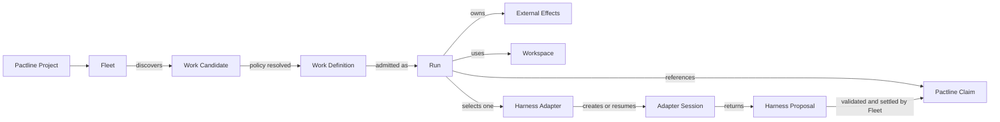
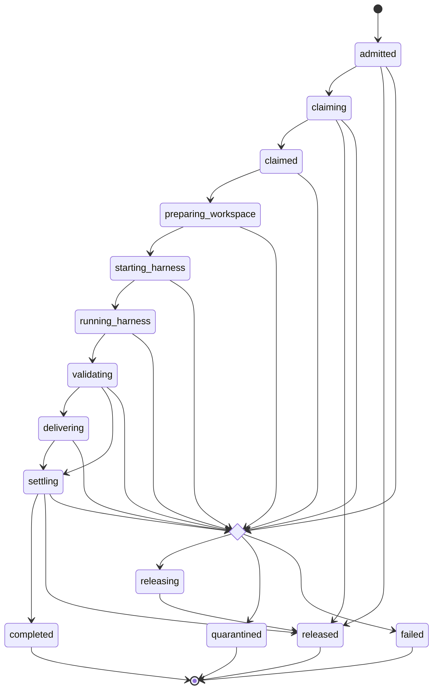

# Pactline Fleet Domain Model and Review Guide

**Date:** 2026-08-17

**Status:** Current implementation inventory for M5.4 review

## Purpose

This document maps the current Fleet domain language to implementation
boundaries. It is a review aid, not a declaration that the present code has the
ideal aggregate design. Canonical terms live in
[Fleet Context](../fleet/CONTEXT.md); product workflow semantics remain in
[Pactline Product Model](product-model.md).

## Bounded context

Fleet is a standalone coordination context. It consumes Pactline workflow
authority and repository-provider truth, invokes a selected Agent Harness, and
keeps only the local facts required to schedule, recover, and observe its own
work.

| Boundary | Authoritative facts |
|---|---|
| Pactline | Project, Task, Claim, lifecycle, criteria, Threads, checks, frozen review delivery, authentication and idempotency |
| Repository and provider | Commit reachability, branches, PR/MR identity and current provider evidence |
| Fleet | Fleet configuration, Run identity and state, frozen coordination policy, checkpoints, effect intent/observation and local health |
| Harness Adapter | Harness capability and native Session lifecycle; bounded events, usage and structured proposal |
| Work Plugin | Repository-policy resolution and credentialed delivery operations selected by Fleet configuration |

Fleet does not mirror Pactline into a second workflow model. A local Run can be
terminal while the Task remains available for another Run, and a completed
Run does not mean the Task itself is done.

## Concept classification

| Concept | Current classification | Identity or equality | Current implementation |
|---|---|---|---|
| Fleet Service | Local process boundary with durable identity | generated `serviceId`, stable for one registry | `service/fleet-service.ts`, `registry/fleet-registry.ts` |
| Fleet | Configuration-defined local policy entity | `fleetId`; at most one enabled Fleet per Project in one service | `config/types.ts`, `config/load.ts` |
| Run | Local coordination entity and likely aggregate root | generated `runId` | `registry/fleet-registry.ts`, `scheduler/run-coordinator.ts` |
| Work Candidate | Ephemeral discovery projection | Fleet, Project, Task and stage tuple | `scheduler/candidate.ts` |
| Work Definition | Immutable admitted policy value | structural value frozen into the Run | `core/work-definition.ts`, `work-plugin/executable-plugin.ts` |
| Adapter Session | Reference to an external Harness entity | immutable `runtimeSessionId` within a Run | `core/harness-adapter.ts` |
| External Effect | Durable child record of a Run | Run plus effect kind; idempotency key globally unique | `registry/fleet-registry.ts` |
| Run Event | Append-only local audit fact | monotonic registry sequence | `registry/fleet-registry.ts` |
| Configuration Snapshot | Immutable configuration value | content-derived revision | `config/types.ts`, `config/manager.ts` |
| Workspace | Disposable resource owned during a Run | recorded exact path and base revision | `repository/workspace.ts` |
| Observation Model | Read-only projection | revisioned response, not domain identity | `observation/model.ts`, `observation/projection.ts` |
| Harness Proposal | Untrusted structured value | must match frozen Run and Claim identity | `core/harness-result.ts` |

`FleetRunRecord` is currently the persisted representation and the object
passed across coordination services. Whether it should remain both persistence
record and domain entity is an explicit review question.

## Relationships

Cardinality and identity rules:

- one Fleet Service connects to one Pactline instance;
- one Fleet belongs to exactly one Project;
- one Project has at most one enabled Fleet within one service configuration;
- different services may independently configure Fleets for the same Project;
- one Run coordinates exactly one Task and one Run Stage after admission;
- one Run has at most one immutable Claim identity and one immutable Adapter
  Session identity;
- one Run may own multiple typed External Effects and Run Events;
- Pactline, not Fleet, globally decides which concurrent Claim attempt wins.

## Run lifecycle

The registry permits the explicit transitions defined in
`registry/fleet-registry.ts`. The coordinator normally resolves operational
errors by releasing a known Claim or quarantining an ambiguous effect. The
separate meaning and reachable use of terminal `failed` should be reviewed.

## Current invariants

### Admission and identity

- Task number, Task version, Run Stage, and complete credential-free policy are
  frozen before Claim creation.
- one service cannot have two non-terminal Runs for the same Fleet, Task and
  Run Stage;
- Claim and Adapter Session identities cannot change after first persistence;
- a Work Definition cannot change the identity of the discovered candidate;
- an Adapter is selected before Claim creation and recovery never substitutes
  another Adapter.

### Authority

- Task prose is not repository or verification authority;
- Harness output is a proposal and must match Run, Claim, Task, criteria,
  allowed-path and fixed-command facts;
- only Fleet Core applies verification, delivery and Pactline settlement;
- Harness processes do not receive Pactline or provider write credentials;
- a Work Plugin is trusted for the explicitly configured repository boundary.

### Effects and recovery

- an external effect records immutable intent before the operation and an
  observation after its result is known;
- each effect kind is unique within a Run and each idempotency key is globally
  unique in one registry;
- startup reconciles every non-terminal Run before new discovery;
- a resumable Session may continue only with its frozen Adapter and identity;
- a non-resumable known Claim is released rather than silently adopted;
- an uncertain delivery, settlement, or release is quarantined when authority
  cannot be re-read safely.

### Observation

- the Web UI and observation API are projections, never mutation surfaces;
- raw prompts, model reasoning, credentials, unbounded Harness output and raw
  registry rows are outside the observation contract;
- SQLite is a local coordination ledger, not workflow authority.

## Review seams

The current implementation deliberately separates behavior into these seams:

1. `config/` defines and atomically reloads Fleet policy.
2. `scheduler/fair-scheduler.ts` discovers and admits candidates fairly.
3. `scheduler/run-coordinator.ts` coordinates the Run state and recovery
   protocol.
4. `registry/fleet-registry.ts` persists transitions, effects and events.
5. `core/` validates Harness-neutral requests, proposals and settlement.
6. `adapters/` translate Codex, DeepSeek and Replay behavior only.
7. `work-plugin/` resolves repository policy and performs delivery effects.
8. `pactline/` owns the installed CLI boundary and workflow settlement.
9. `observation/`, `health/` and `http/` expose bounded read models.

## Domain review questions

These are open review prompts, not confirmed defects:

1. Should Run become an explicit aggregate with transition methods instead of
   exposing `FleetRunRecord` plus registry transition operations?
2. Are Run state, free-form checkpoint, effect status and disposition four
   useful concepts, or do they permit contradictory combinations?
3. Should External Effect kind, intent and observation become a discriminated
   union rather than string plus generic JSON?
4. Is `frozenPolicy` too weakly typed at the registry boundary, and which
   policy fields must be first-class for migration compatibility?
5. Is terminal `failed` semantically distinct from `released` and
   `quarantined`, and is it reachable through intended application behavior?
6. Should resolution analysis remain a Harness activity within a Run, or is it
   a separately identifiable coordination stage?
7. Is Fleet best kept as configuration-defined policy, or does future operator
   behavior require a durable Fleet entity independent of configuration?
8. Does the Run aggregate own workspace cleanup and history retention, or are
   those separate operational policies?
9. Which Pactline version facts belong in Run identity versus Effect
   observations during repeated submissions and review cycles?

## Code review handoff

Review the implementation range `165251c..c114c99`. It contains three Fleet
commits:

1. `2dfe17b` — Harness-neutral Fleet Service, scheduling and recovery;
2. `6f97e02` — local Operations Console and observation API;
3. `c114c99` — bounded usability acceptance and integration fixes.

Recommended review order:

1. domain contracts and validation under `fleet/src/core/`;
2. Run persistence and recovery under `fleet/src/registry/`,
   `fleet/src/scheduler/`, and `fleet/src/recovery/`;
3. Pactline, repository and work-plugin authority boundaries;
4. Codex and DeepSeek Adapter parity;
5. service lifecycle, configuration, health and observation;
6. Web UI projections;
7. M5.4 evaluation code and acceptance evidence.

Use [Fleet Architecture](pactline-fleet-architecture.md),
[Fleet Service Architecture](pactline-fleet-service-architecture.md), and the
[M5.4 Acceptance Report](pactline-fleet-m5-4-report.md) as the governing design,
resident-service design, and verified capability baseline respectively.

## Known review boundary

M5.4 accepts bounded local trials, not production operation. Automatic history
retention, exhaustive crash qualification, independent Fleet Services
competing for one Project, storage faults, long-duration soak, live provider
failure, remote administration, and production sandbox and credential
qualification remain outside the current implementation acceptance boundary.
